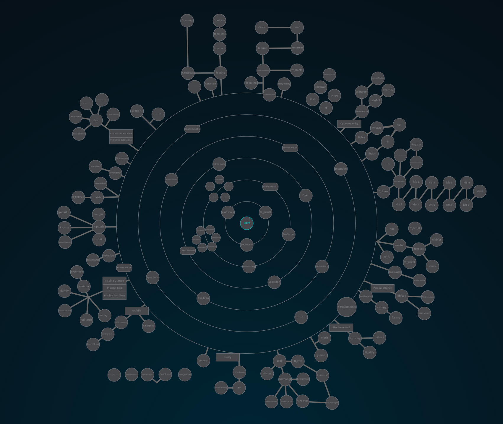
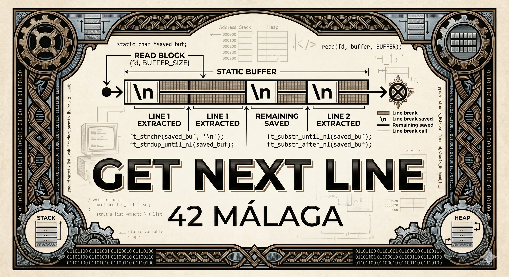
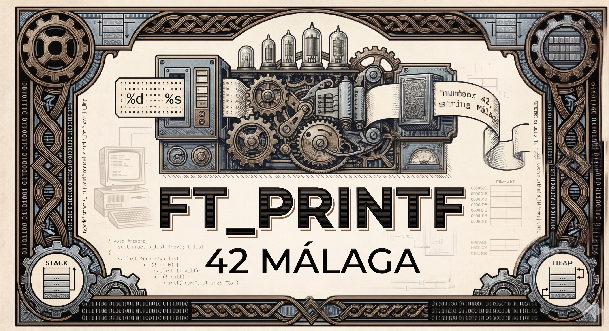
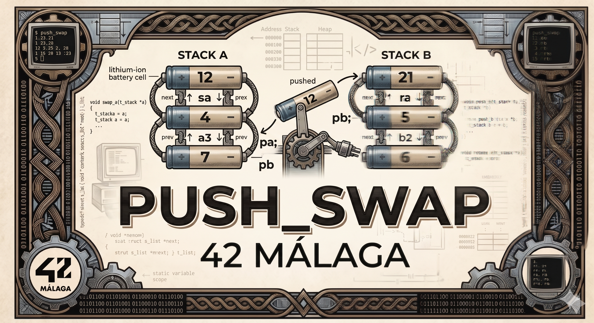

# 🚀 42 Málaga Cursus Repository

¡Bienvenido a mi repositorio de aprendizaje en **42 Málaga**! Aquí documento mi progreso a través de los diversos proyectos que componen el Cursus.

## 🗺️ Mapa de Carrera (HolyGraph)
El Cursus Principal está organizado en anillos donde necesitas aprobar los proyectos de la capa anterior para seguir avanzando.

---

## 🏗️ Milestone 0: Fundamentos

<table>
  <tr>
    <td width="200" valign="middle" align="center">
      
    </td>
    <td valign="middle">
      <h3><a href="milestone0/libft">libft</a></h3>
      
La base de todo. Recreación de funciones de la <code>libc</code> y funciones auxiliares. Creando la librería <code>libft.a</code> que se reusa como librería.

    </td>
  </tr>
</table>

---

## ⚙️ Milestone 1: Profundizando en C

<table>
  <tr>
    <td width="200" valign="middle" align="center">
      
    </td>
    <td valign="middle">
      <h3><a href="milestone1/get_next_line">get_next_line</a></h3>
      
Lectura de archivos línea a línea, devolviendo strings reservados en memoria dinámica hasta el salto de línea. Manejo de variables estáticas.

    </td>
  </tr>
</table>

 

<table>
  <tr>
    <td width="200" valign="middle" align="center">
      
    </td>
    <td valign="middle">
      <h3><a href="milestone1/ft_printf">ft_printf</a></h3>
      
Reimplementación de <code>printf</code> usando argumentos variádicos, tratando una serie de conversiones y tratando los tipos de datos.

    </td>
  </tr>
</table>

 

<table>
  <tr>
    <td width="200" valign="middle" align="center">
      
    </td>
    <td valign="middle">
      <h3><a href="milestone1/push_swap">push_swap</a></h3>
      
Algoritmos de ordenación, respetando orden de complejidad y tratamiento de listas doblemente enlazadas.

    </td>
  </tr>
</table>

---

## 🛠️ Tecnologías
* **Lenguaje:** C (Norminette compliant)
* **Entorno:** Sistema Unix / macOS

---
*Nota: Este repositorio es parte de mi formación.*